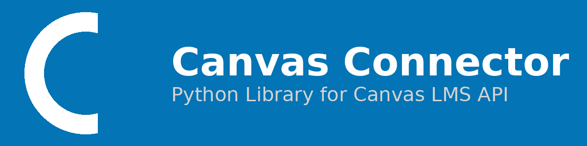

# Canvas Connector

A Python package for easily connecting to the Canvas LMS API.

## Features

- Easy authentication with Canvas API
- Fetch courses, assignments, and grades (WIP)
- Get peer information
- Track upcoming assignments
- Built with Polars for fast data processing

## Installation

### Using uv (recommended)

```bash
uv pip install git+https://github.com/byuirpytooling/canvasconnector.git
```

### Using pip

```bash
pip install git+https://github.com/byuirpytooling/canvasconnector.git
```

### For development (contributing)

```bash
# Fork the repository on GitHub first, then clone your fork
git clone https://github.com/YOUR-USERNAME/canvasconnector.git
cd canvasconnector

# Create a virtual environment and install
uv venv
uv sync

# Make your changes, then push to your fork and create a PR
```

## Setup

### 1. Get Your Canvas API Token

1. Log into Canvas
2. Go to Account → Settings
3. Scroll to "Approved Integrations"
4. Click "+ New Access Token"
5. Copy the token (you won't see it again!)

### 2. Create a `.env` file

Create a `.env` file in your project root:

```plaintext
CANVAS_API_TOKEN=your_canvas_api_token_here
CANVAS_URL=https://byui.instructure.com
TIMEZONE=America/Denver
```

**Important**: Add `.env` to your `.gitignore` to keep your token private!

## Quick Start

```python
from canvasconnector import CanvasClient, get_courses_polars
import os
from dotenv import load_dotenv

# Load environment variables
load_dotenv()

# Create client
client = CanvasClient(
    api_key=os.getenv("CANVAS_API_TOKEN"),
    canvas_url=os.getenv("CANVAS_URL"),
    timezone=os.getenv("TIMEZONE")  # Optional: defaults to UTC
)

# Get your courses
courses = get_courses_polars(client, current_only=True)
print(courses)
```

## Documentation

For detailed usage examples, see our [Code Examples guide](https://byuirpytooling.github.io/canvasconnector/code-examples/).
